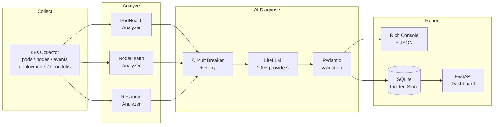

# Argus-Ops

[](https://github.com/mason5052/argus-ops/actions/workflows/ci.yml)
[](https://badge.fury.io/py/argus-ops)
[](https://www.python.org/downloads/)
[](LICENSE)
[](https://codecov.io/gh/mason5052/argus-ops)

AI-powered infrastructure monitoring CLI that detects issues, diagnoses root causes,
and (coming soon) executes remediation across Kubernetes, VMs, and bare metal servers.

```bash
pip install argus-ops
argus-ops scan
argus-ops diagnose
```

## The Problem

Modern infrastructure runs dozens of services across hundreds of nodes. Existing tools
either surface alerts without context (Prometheus), require deep K8s expertise to interpret
(kubectl), or lock you into expensive SaaS platforms. There is no open-source CLI tool that:

- Scans your entire infrastructure in seconds
- Uses AI to explain *why* something is broken in plain English
- Proposes specific remediation steps based on your actual cluster state
- Works with any LLM (OpenAI, Anthropic, Ollama, 100+ providers)

Argus-Ops fills that gap.

## Architecture



The pipeline is modular -- each stage uses pluggable abstract base classes,
so you can add custom collectors, analyzers, or AI providers without touching core code.

## Quick Start

### Install

```bash
# Core CLI
pip install argus-ops

# With web dashboard
pip install "argus-ops[web]"
```

### Configure

```bash
argus-ops config init
# Edit ~/.argus-ops/config.yaml to set your AI provider
export OPENAI_API_KEY=sk-...
```

### Run

```bash
# Scan only (no AI, fast, free)
argus-ops scan

# Scan + AI root cause analysis
argus-ops diagnose

# Filter by severity
argus-ops scan --severity high

# Specific namespaces
argus-ops scan --namespace rpa --namespace zrpa-demo

# JSON output
argus-ops scan --output json | jq '.[] | select(.severity == "critical")'

# Use a different AI model
argus-ops diagnose --model gpt-4o
argus-ops diagnose --model claude-sonnet-4-6
argus-ops diagnose --model ollama/llama3.2   # local, no API key needed

# Web dashboard (requires argus-ops[web])
argus-ops serve
```

## Supported AI Providers

Argus-Ops uses [LiteLLM](https://github.com/BerriAI/litellm) for unified LLM access.
Set your preferred model in config.yaml and export the API key:

| Provider   | Model Example                  | API Key Env Var       |
|------------|--------------------------------|-----------------------|
| OpenAI     | gpt-4o-mini, gpt-4o            | OPENAI_API_KEY        |
| Anthropic  | claude-haiku-4-5-20251001      | ANTHROPIC_API_KEY     |
| Ollama     | ollama/llama3.2 (local)        | (none required)       |
| Azure      | azure/gpt-4o                   | AZURE_API_KEY         |
| Bedrock    | bedrock/claude-3-haiku         | AWS credentials       |
| Gemini     | gemini/gemini-1.5-flash        | GEMINI_API_KEY        |

For Ollama (fully local, no data sent to cloud):

```yaml
# ~/.argus-ops/config.yaml
ai:
  model: ollama/llama3.2
  base_url: http://localhost:11434
```

## Built-in Detections

| Analyzer      | Detections                                                          |
|---------------|---------------------------------------------------------------------|
| pod_health    | CrashLoopBackOff, OOMKilled, ImagePullBackOff, Pending timeout, Failed |
| node_health   | NotReady, MemoryPressure, DiskPressure, PIDPressure, Cordoned       |
| resource      | Containers without CPU/memory limits, memory allocation ratio       |

## Configuration

```yaml
# ~/.argus-ops/config.yaml

ai:
  provider: openai
  model: gpt-4o-mini
  api_key_env: OPENAI_API_KEY    # env var containing the API key
  base_url: null                 # custom URL (Ollama: http://localhost:11434)
  temperature: 0.3
  max_tokens: 4096
  cost_limit_per_run: 0.50       # USD -- stops AI calls if exceeded

targets:
  kubernetes:
    enabled: true
    kubeconfig: null             # null = default ~/.kube/config
    context: null                # null = current context
    namespaces: []               # empty = scan all
    exclude_namespaces:
      - kube-system

analyzers:
  resource:
    memory_warning: 85           # % allocation to trigger warning
    memory_critical: 95
  pod_health:
    crashloop_restart_threshold: 5
    pending_timeout_minutes: 10
```

Environment variable overrides (higher priority than file):

```bash
ARGUS_OPS_AI_MODEL=gpt-4o argus-ops diagnose
ARGUS_OPS_AI_BASE_URL=http://localhost:11434 argus-ops diagnose --model ollama/llama3.2
```

## Repository Structure

```
src/argus_ops/
  cli.py              - Click CLI (scan, diagnose, config, serve commands)
  config.py           - YAML + env var config loader
  models.py           - Pydantic data models (Finding, Diagnosis, Incident)
  store.py            - SQLite incident history (WAL mode, survives restarts)
  logging_config.py   - JSON-structured logging + RotatingFileHandler
  collectors/         - Infrastructure data collection
    base.py           - BaseCollector ABC
    k8s.py            - Kubernetes collector (timeout, event redaction)
  analyzers/          - Rule-based anomaly detection
    base.py           - BaseAnalyzer ABC
    pod_health.py     - CrashLoopBackOff, OOMKilled, Pending, ImagePullBackOff
    node_health.py    - NotReady, pressure conditions, cordoned nodes
    resource.py       - Missing CPU/memory limits, allocation ratios
  ai/                 - LiteLLM AI provider + Jinja2 prompt templates
    provider.py       - LiteLLM with Pydantic validation, 32 KB response limit
    cost.py           - Token/cost tracking (Decimal arithmetic)
  engine/
    pipeline.py       - Collect->Analyze->Diagnose with retry + circuit breaker
  reporters/          - Rich console + JSON output formatters
  web/
    api.py            - FastAPI endpoints
    watch_service.py  - Background scan loop + DiagnoseStatus enum
tests/
  conftest.py         - Shared fixtures (mock K8s snapshots, findings)
  fixtures/           - JSON mock data for offline testing
  test_analyzers.py   - 15 analyzer tests
  test_models.py      - 9 model tests
  test_config.py      - 9 config tests
  test_pipeline.py    - 15 pipeline tests (incl. circuit breaker)
  test_reporters.py   - 5 reporter tests
  test_store.py       - 16 SQLite store tests
  test_cli.py         - 19 CLI tests
  test_api.py         - 23 API endpoint tests
deploy/k8s/           - Kubernetes deployment manifests
```

## Reliability Features

Argus-Ops is built for production use:

- **Exponential backoff retry** (tenacity): each collector retries up to 3 times with 2s -> 4s -> 8s wait before reporting failure
- **Circuit breaker** per collector: after 3 consecutive failures, the circuit opens for 60 seconds to prevent thundering-herd API calls against an unreachable cluster
- **K8s API timeouts**: all Kubernetes API calls use a 30-second timeout
- **LLM timeouts**: all LiteLLM completion calls use a 60-second timeout
- **LLM response validation**: responses are parsed through a Pydantic model with a 32 KB size limit
- **Event message redaction**: Bearer tokens, private registry credentials, and RFC-1918 IPs are stripped before sending to AI providers
- **SQLite incident history**: incidents persist across restarts with WAL journal mode
- **JSON structured logging**: machine-readable logs with RotatingFileHandler (10 MB / 5 backups)

## Extending Argus-Ops

### Add a custom collector

```python
from argus_ops.collectors.base import BaseCollector
from argus_ops.models import HealthSnapshot, InfraType

class MyCollector(BaseCollector):
    @property
    def name(self) -> str:
        return "my_collector"

    @property
    def infra_type(self) -> InfraType:
        return InfraType.KUBERNETES

    def is_available(self) -> bool:
        return True

    def collect(self) -> list[HealthSnapshot]:
        return [HealthSnapshot(
            collector_name=self.name,
            infra_type=self.infra_type,
            target="my://target",
            data={"custom": "data"},
        )]
```

### Add a custom analyzer

```python
from argus_ops.analyzers.base import BaseAnalyzer
from argus_ops.models import Finding, FindingCategory, HealthSnapshot, Severity, InfraType

class MyAnalyzer(BaseAnalyzer):
    @property
    def name(self) -> str:
        return "my_analyzer"

    def analyze(self, snapshots: list[HealthSnapshot]) -> list[Finding]:
        findings = []
        for snapshot in snapshots:
            # your detection logic here
            pass
        return findings
```

## Roadmap

- [x] v0.1.0 - K8s scan + AI diagnosis + Rich console output
- [x] v0.2.0 - Security hardening (timeouts, event redaction, LLM response validation)
- [x] v0.3.0 - Reliability hardening (circuit breaker, retry, SQLite history, 109 tests)
- [ ] v0.4.0 - SSH collector (bare metal/VMs) + Slack/Teams notifications
- [ ] v0.5.0 - Remediation engine with human approval gate (K8s Healer)
- [ ] v1.0.0 - Helm chart, Docker Hub image, stable API

## Contributing

See [CONTRIBUTING.md](CONTRIBUTING.md) for the full guide: dev environment setup,
how to add collectors and analyzers, test requirements, and PR checklist.

## Security

To report a vulnerability, see [SECURITY.md](SECURITY.md).

## Author

Mason Kim - DevSecOps Engineer
GitHub: [mason5052](https://github.com/mason5052)
LinkedIn: [linkedin.com/in/mason-kim-devops](https://linkedin.com/in/mason-kim-devops)

## License

MIT License - see [LICENSE](LICENSE) for details.
