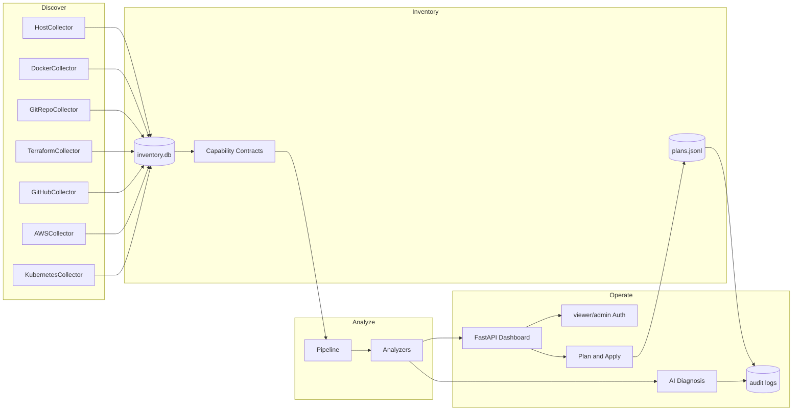

# Argus-Ops

Argus-Ops is an AI-assisted infrastructure discovery and operations platform for DevSecOps teams.

It currently combines five practical layers:
- runtime and local discovery across Kubernetes and the installation host
- capability-aware analysis so unsupported analyzers are skipped safely
- authenticated web and CLI workflows with `viewer` and `admin` separation
- structured planning and apply scaffolding for change requests
- audit logging for web, CLI, authentication, and admin actions

Argus-Ops is moving from "install and inspect" toward "install, understand, plan, and operate". The current release implements the discovery, inventory, capability, authentication, audit, dashboard, and action-plan foundations for that direction.

## What Argus-Ops Does Today

Current implemented scope:
- Kubernetes collection and analysis for pods, nodes, deployments, cronjobs, services, storage, quotas, and network policies
- local discovery for `HostCollector`, `DockerCollector`, `GitRepoCollector`, `TerraformCollector`, `GitHubCollector`, `AWSCollector`, and `KubernetesCollector`
- capability contracts between collectors and analyzers so missing data does not produce misleading analyzer output
- inventory storage in `inventory.db` with assets, relations, and discovered capabilities
- web authentication with `viewer` and `admin` roles
- admin-only mutating workflows for diagnosis, user management, settings updates, and plan apply
- structured `argus-ops plan` and `argus-ops apply` flows backed by persisted action plans
- built-in workflow catalog and plugin registry surfaces for future extensibility
- Helm deployment profiles for `viewer` and `admin` RBAC
- SSE-backed dashboard refresh with polling fallback
- MCP-compatible manifest metadata at `/api/mcp/manifest` when `argus-ops serve --mcp` is enabled

## Current Product Boundary

Argus-Ops currently focuses on:
- Kubernetes runtime visibility
- local discovery from the installation host or container filesystem
- local SQLite-backed authentication and audit storage
- on-demand AI diagnosis from collected findings
- structured planning before change execution

Argus-Ops now includes plan/apply scaffolding, a workflow catalog, and a plugin registry. It does not yet implement full GitOps pull-request execution, full Terraform automation, production-grade progressive rollout control, Slack or Teams ChatOps, or a full MCP protocol server.

## Public Repository Boundary

This public repository is a source repository and validation surface.

It does not automatically publish Docker images, PyPI packages, or Helm charts from GitHub Actions.
The project now uses a manual release process.
Enterprise deployment overlays, credentials, kubeconfig files, cloud mappings, and environment-specific values must stay in a private repository.

Public examples in this repository are intentionally generic:
- no internal IP addresses
- no enterprise hostnames
- no enterprise node labels
- no production overlays
- no deployment credentials

## Installation

### Core CLI

```bash
pip install argus-ops
```

### Web Dashboard And Auth Extras

```bash
pip install "argus-ops[web,auth]"
```

### Manual Docker Build And Run

Build a local image first:

```bash
docker build -t argus-ops:manual .
```

Run the local image with a placeholder environment variable name only. Do not paste a real key into committed examples:

```bash
docker run --rm -it \
  -v ~/.kube:/home/argus/.kube:ro \
  -v ~/.argus-ops:/home/argus/.argus-ops \
  -e OPENAI_API_KEY=sk-... \
  argus-ops:manual \
  argus-ops inventory
```

### Manual Helm Example

Use the local chart path instead of a published chart repository:

```bash
helm upgrade --install argus-ops ./deploy/helm/argus-ops \
  --namespace monitoring --create-namespace \
  --set image.repository=argus-ops \
  --set image.tag=manual \
  --set existingSecret.name=argus-ops-secrets \
  --set rbac.profile=viewer
```

Admin-capable example:

```bash
helm upgrade --install argus-ops ./deploy/helm/argus-ops \
  --namespace monitoring --create-namespace \
  --set image.repository=argus-ops \
  --set image.tag=manual \
  --set existingSecret.name=argus-ops-secrets \
  --set rbac.profile=admin
```

Create the AI secret beforehand when diagnosis is required:

```bash
kubectl create secret generic argus-ops-secrets \
  --from-literal=openai-api-key=sk-... \
  -n monitoring
```

## Quick Start

### 1. Bootstrap The Local Install

```bash
argus-ops bootstrap
```

This command:
- creates `~/.argus-ops/config.yaml`
- creates the first admin account
- initializes auth, session, audit, inventory, and plan storage
- runs discovery and prints a summary of assets and capabilities

`argus-ops config init` is kept as a compatibility alias and performs the same bootstrap flow.

### 2. Log In

```bash
argus-ops login
argus-ops whoami
```

### 3. Inspect Discovered Inventory

```bash
argus-ops inventory
argus-ops inventory --output json
argus-ops connectors list
```

### 4. Create And Review Action Plans

```bash
argus-ops plan "summarize the infrastructure discovered on this host"
argus-ops plan "restart the broken pod" --mode direct
argus-ops workflows export --plan-id PLAN-12345678
argus-ops apply --plan-id PLAN-12345678 --approve
argus-ops executions
argus-ops workflows list
argus-ops plugins list
```

### 5. Run Kubernetes Analysis

```bash
argus-ops scan
argus-ops scan --severity high
argus-ops scan --namespace rpa --namespace monitoring
```

### 6. Run Admin-Only AI Diagnosis

```bash
argus-ops diagnose
argus-ops diagnose --model gpt-4o
```

### 7. Start The Dashboard

```bash
argus-ops serve
argus-ops serve --mcp
```

Useful endpoints:
- `/healthz` public health probe
- `/` authenticated dashboard or login page
- `/docs` admin-only Swagger UI
- `/api/mcp/manifest` viewer-accessible tool manifest when MCP mode is enabled

## Manual Release And Deployment

GitHub Actions in this public repository run PR validation only.
Maintainers handle build, test, packaging, registry upload, and enterprise deployment manually from a trusted workstation.

Recommended local validation flow:

```bash
ruff check src/ tests/
pytest
python -m build
docker build -t argus-ops:manual .
helm template argus-ops ./deploy/helm/argus-ops \
  --set image.repository=argus-ops \
  --set image.tag=manual
```

Optional local packaging:

```bash
helm package ./deploy/helm/argus-ops
```

If you deploy to an enterprise environment, keep these assets outside this repository:
- production values files
- private overlay manifests
- kubeconfig files
- registry credentials
- cloud account mappings
- ingress hostnames tied to a real company environment

## Operating Flow

From install time to normal operation, the application works like this:
1. `argus-ops bootstrap` writes config, initializes local auth, and creates the first admin account.
2. discovery collectors inspect the local environment and optional Kubernetes connectivity.
3. discovered assets, relations, and capabilities are stored in `inventory.db`.
4. the dashboard and CLI read from that inventory to present current infrastructure context.
5. Kubernetes analysis produces findings only when the required collector capabilities are present.
6. authenticated users review findings, inventory, topology, workflows, plugins, and prior diagnoses.
7. users submit natural-language requests through `argus-ops plan` or `POST /api/plan`.
8. Argus-Ops classifies the request as read-only or mutating, builds an `ActionPlan`, exports a workflow-as-code YAML file, and stores both for later review.
9. viewer and admin users may inspect the stored workflow export and plan metadata through the dashboard, CLI, or API.
10. admin users may apply a stored plan through `argus-ops apply` or `POST /api/apply`.
11. every apply attempt stores execution artifacts, verification results, and an execution history record.
12. every important action is written to the audit log.

## Discovery Model

Argus-Ops uses discovery collectors to build an inventory graph and stores the result in `inventory.db`.

Implemented collectors:
- `HostCollector`
- `DockerCollector`
- `GitRepoCollector`
- `TerraformCollector`
- `GitHubCollector`
- `AWSCollector`
- `KubernetesCollector`

Discovery is intentionally conservative:
- local discovery uses the installation host and configured scan paths
- Kubernetes discovery uses the active kubeconfig or in-cluster credentials
- GitHub discovery currently checks configured token presence from the local environment
- AWS discovery currently checks locally configured profiles from `~/.aws`
- Argus-Ops does not perform aggressive network scanning or unauthorized credential harvesting

## Capability Contracts

Collectors advertise `provided_capabilities` and analyzers declare `required_capabilities`.

This prevents the old failure mode where analyzers appeared to support a domain that the active collector never actually populated.

Examples:
- Kubernetes snapshots publish `k8s.cluster_inventory`
- `ResourceAnalyzer`, `PodHealthAnalyzer`, `NodeHealthAnalyzer`, `SecurityAnalyzer`, `StorageAnalyzer`, `NetworkPolicyAnalyzer`, `ConfigurationAnalyzer`, and `CronJobAnalyzer` require that capability
- discovery collectors publish inventory-oriented capabilities such as `host.identity`, `docker.containers`, `git.repositories`, `terraform.roots`, `github.repositories`, and `aws.profiles`

## Authentication And Roles

Argus-Ops uses a local SQLite-backed user store.

Supported roles:
- `viewer`: read-only access to dashboard data, inventory, topology, findings, diagnoses history, plans, workflows, plugins, and status
- `admin`: all viewer permissions plus diagnosis, settings changes, user management, plan apply, and remediation actions

Role enforcement applies in the web API and in admin CLI commands.

Admin-only operations include:
- `POST /api/diagnose`
- `POST /api/settings`
- `POST /api/apply`
- `/api/admin/users*`
- `/api/admin/audit`
- CLI user management commands
- CLI heal flows
- mutating `argus-ops plan` requests

## Audit Logging

Argus-Ops records activity in JSONL audit files and separate auth event logs.

Tracked activity includes:
- login success and failure
- logout
- authenticated web requests
- CLI inventory, scan, plan, apply, diagnose, heal, login, logout, and user-management actions
- admin API requests and permission failures

Audit records include:
- actor
- role
- request id
- session id
- source
- action
- intent
- status code
- risk level
- result status

Secrets are not written into audit records.

## Dashboard

The dashboard provides:
- Overview: findings, node count, asset count, capability count, and session summary
- Findings: current analyzer output with admin-triggered diagnosis button
- Inventory: discovered assets from the latest inventory summary
- AI Diagnoses: incident history from `history.db`
- Automation: plan creation, workflow export inspection, recent execution history, workflow catalog, and built-in plugin registry
- Audit: recent audit summary for admin users and a viewer-safe message for read-only users

Dashboard updates use server-sent events from `/api/events` and fall back to timed refresh when the SSE stream is unavailable.

## CLI Reference

```text
argus-ops bootstrap
argus-ops login
argus-ops whoami
argus-ops inventory
argus-ops plan
argus-ops apply
argus-ops executions
argus-ops workflows list
argus-ops workflows export
argus-ops plugins list
argus-ops connectors list
argus-ops scan
argus-ops diagnose
argus-ops serve
argus-ops heal
argus-ops audit
argus-ops user add
argus-ops user list
argus-ops user role
argus-ops user disable
argus-ops user enable
argus-ops user remove
argus-ops config init
argus-ops config show
argus-ops config test
```

## API Surface

Viewer APIs:
- `GET /api/auth/me`
- `GET /api/status`
- `GET /api/scan`
- `GET /api/nodes`
- `GET /api/inventory`
- `GET /api/assets`
- `GET /api/topology`
- `GET /api/plans`
- `GET /api/executions`
- `GET /api/workflows`
- `GET /api/workflows/export/{plan_id}`
- `GET /api/plugins`
- `GET /api/diagnoses`
- `GET /api/trend`
- `GET /api/settings`
- `GET /api/events`
- `GET /api/mcp/manifest` when MCP mode is enabled
- `POST /api/plan` for read-only requests

Admin APIs:
- `POST /api/plan` for mutating requests
- `POST /api/apply`
- `POST /api/diagnose`
- `POST /api/settings`
- `GET /api/admin/users`
- `POST /api/admin/users`
- `PATCH /api/admin/users/{username}`
- `POST /api/admin/users/{username}/password`
- `DELETE /api/admin/users/{username}`
- `GET /api/admin/audit`

Public APIs:
- `GET /healthz`
- `POST /api/auth/login`
- `POST /api/auth/logout`

## Configuration

Default config path:
- `~/.argus-ops/config.yaml`

Container and Helm deployments can also point the CLI to a mounted config file by setting:

```bash
ARGUS_OPS_CONFIG=/etc/argus-ops/config.yaml
```

Example config:

```yaml
ai:
  provider: openai
  model: gpt-4o-mini
  api_key_env: OPENAI_API_KEY
  base_url: null
  temperature: 0.3
  max_tokens: 4096
  cost_limit_per_run: 0.50

targets:
  kubernetes:
    enabled: true
    kubeconfig: null
    context: null
    namespaces: []
    exclude_namespaces:
      - kube-system
      - kube-public
      - kube-node-lease
  host:
    enabled: true
    paths: []
  docker:
    enabled: true
  git:
    enabled: true
    paths: []
    max_depth: 4
  terraform:
    enabled: true
    paths: []
    max_depth: 4
  github:
    enabled: true
    token_env: GITHUB_TOKEN
  aws:
    enabled: true

inventory:
  enabled: true
  paths: []
  max_depth: 4

auth:
  session_ttl_hours: 24
  data_dir: null
  cookie_name: argus_ops_session

serve:
  host: 127.0.0.1
  port: 8080
  reload_interval: 30
  watch_interval: 30
  open_browser: true
  mcp: false
```

Environment overrides:

```bash
ARGUS_OPS_CONFIG=/etc/argus-ops/config.yaml
ARGUS_OPS_AI_MODEL=gpt-4o
ARGUS_OPS_AI_BASE_URL=http://localhost:11434
ARGUS_OPS_GITHUB_TOKEN_ENV=GH_TOKEN
ARGUS_OPS_LOG_LEVEL=DEBUG
```

## Helm Profiles

The Helm chart separates configuration and writable runtime state:
- config is mounted at `/etc/argus-ops/config.yaml`
- runtime data remains in `/home/argus/.argus-ops`
- liveness and readiness probes use `/healthz`

RBAC profiles:
- `viewer`: read-only Kubernetes access for discovery and analysis
- `admin`: adds the minimum mutating verbs required for remediation and apply flows

Public-safe local chart examples:

```bash
helm upgrade --install argus-ops ./deploy/helm/argus-ops \
  --set image.repository=argus-ops \
  --set image.tag=manual \
  --set rbac.profile=viewer
```

```bash
helm upgrade --install argus-ops ./deploy/helm/argus-ops \
  --set image.repository=argus-ops \
  --set image.tag=manual \
  --set rbac.profile=admin
```

## Architecture


```mermaid
flowchart LR
    subgraph Discover
        HOST[HostCollector]
        DOCKER[DockerCollector]
        GIT[GitRepoCollector]
        TF[TerraformCollector]
        GH[GitHubCollector]
        AWS[AWSCollector]
        K8S[KubernetesCollector]
    end

    subgraph Inventory
        INV[(inventory.db)]
        CAP[Capability Contracts]
        PLAN[(plans.jsonl)]
    end

    subgraph Analyze
        PIPE[Pipeline]
        ANA[Analyzers]
    end

    subgraph Operate
        WEB[FastAPI Dashboard]
        AUTH[viewer/admin Auth]
        AUTO[Plan and Apply]
        AUDIT[(audit logs)]
        AI[AI Diagnosis]
    end

    HOST --> INV
    DOCKER --> INV
    GIT --> INV
    TF --> INV
    GH --> INV
    AWS --> INV
    K8S --> INV
    INV --> CAP --> PIPE --> ANA --> WEB
    WEB --> AUTH
    WEB --> AUTO --> PLAN --> AUDIT
    ANA --> AI --> AUDIT
```

## MCP Mode

`argus-ops serve --mcp` currently enables an MCP-compatible manifest endpoint. This is a scaffold for external assistant integration, not a full MCP protocol server.

Current MCP-mode output:
- enabled flag in `/api/status`
- tool manifest at `/api/mcp/manifest`
- advertised tools for inventory, scan, topology, plans, workflows, plugins, plan, apply, diagnose, and audit

## Security Notes

- `/healthz` is public for health probes
- all other operational routes require authentication based on `viewer` or `admin`
- `/docs` and OpenAPI output are admin-only
- all authenticated API activity is logged
- password hashes are stored in SQLite using bcrypt when available, with PBKDF2 fallback
- secrets are masked in config display output and excluded from audit payloads
- public examples must stay free of enterprise overlays, internal IPs, and deployment credentials

## Limitations

Current limitations in this release:
- GitHub discovery confirms token configuration, not repository enumeration
- AWS discovery confirms local profile presence, not live cloud topology enumeration
- the new plan/apply flow is a scaffold and does not yet generate real pull requests or infrastructure patches
- direct remediation is limited to the existing Kubernetes healer actions
- ChatOps adapters are not implemented yet
- progressive rollout controllers and metric gates are modeled but not executed yet
- the plugin registry is built-in metadata only and does not yet load external packs
- the MCP implementation is a manifest scaffold, not the final protocol server

## Roadmap

High-priority next steps:
- GitOps execution engine for manifests, Helm values, Terraform, and workflow files
- pull-request automation and PR comment feedback for infrastructure plans
- progressive rollout planning and verification gates
- change correlation and incident timeline views
- ChatOps adapters for Slack, Teams, and Discord
- external plugin SDK and pack loading
- fuller cloud topology collectors for AWS, and later Azure and GCP

## Development And Docs Drift

The repository includes docs-drift tests to keep code and documentation aligned.
GitHub Actions now run PR validation only through `pull_request` and `workflow_dispatch`.
There is no Docker, PyPI, or GitHub Release automation in this public repository.

Run the main checks locally:

```bash
ruff check src/ tests/
pytest
pytest -q tests/test_docs_drift.py
```

## Contributing

See `CONTRIBUTING.md` for development setup, security review expectations, manual release boundaries, and contribution workflow.

## License

MIT License. See `LICENSE`.
